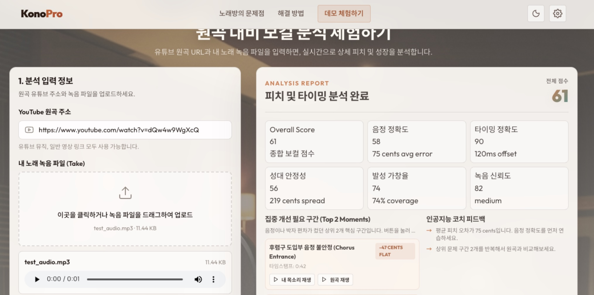
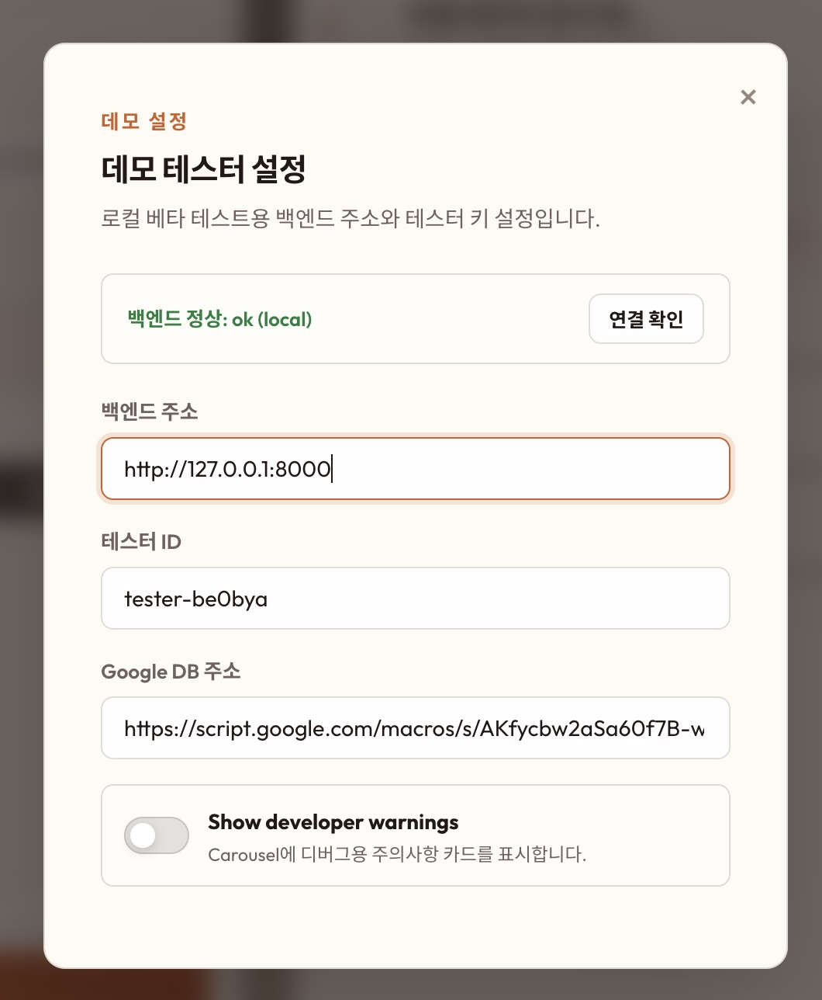

# KonoPro local 실행 가이드



Konopro는 유튜브 원곡과 내 노래 녹음 파일을 비교해 보컬 점수, 문제 구간, 코치 피드백을 보여주는 로컬 웹 MVP입니다.

## 1. 설치 준비

### macOS

Homebrew가 설치되어 있다면:

```bash
brew install uv ffmpeg
```

### Windows

PowerShell에서:

```powershell
winget install astral-sh.uv
winget install Gyan.FFmpeg
```

설치 후 새 터미널을 열고 확인합니다:

```bash
uv --version
ffmpeg -version
```

## 2. 백엔드 설치

```bash
cd backend
uv sync --extra dev --extra stems
```

`stems` 옵션은 Demucs 보컬 분리용 의존성을 설치합니다. 점수 품질에 중요하므로 항상 포함해서 설치합니다.
이 옵션에는 Demucs와 TorchCodec이 포함됩니다. `yt-dlp`도 백엔드 Python 의존성으로 설치되므로 별도 시스템 설치가 필요 없습니다.

확인:

```bash
uv run python -m yt_dlp --version
uv run python -c "import torchcodec; print('torchcodec ok')"
```

## 3. 백엔드 API 실행

첫 번째 터미널:

```bash
cd backend
uv run uvicorn konopro_backend.app:create_app --factory --reload --host 0.0.0.0 --port 8000
```

확인:

```bash
curl http://127.0.0.1:8000/health
```

정상 응답:

```json
{"status":"ok","environment":"local"}
```

## 4. 워커 실행

두 번째 터미널:

```bash
cd backend
uv run konopro-worker
```

API는 분석 작업을 만들고, 워커가 실제 분석을 처리합니다. 데모를 쓰는 동안 계속 켜두세요.

## 5. 프론트엔드 실행

세 번째 터미널:

```bash
cd web
python3 -m http.server 8765
```

브라우저에서 엽니다:

[http://127.0.0.1:8765/](http://127.0.0.1:8765/)

## 6. 프론트엔드 설정

우측 상단 설정 버튼에서 아래 값을 확인합니다:



```text
Backend URL: http://127.0.0.1:8000
Tester ID: 원하는 로컬 테스트 ID
```

`Backend URL`은 반드시 `http://127.0.0.1:8000` 또는 `http://localhost:8000`으로 설정합니다. `ngrok` 주소가 들어가 있으면 로컬 주소로 바꿔주세요.

## 7. 자주 생기는 문제

포트가 이미 사용 중이면:

```bash
lsof -i :8000
lsof -i :8765
```

프론트엔드에서 `NetworkError`가 나면:

1. 백엔드 API가 실행 중인지 확인합니다.
2. 워커가 실행 중인지 확인합니다.
3. 설정의 `Backend URL`이 `http://127.0.0.1:8000`인지 확인합니다.
4. 프론트엔드를 `http://127.0.0.1:8765/`로 열었는지 확인합니다.

코드를 바꾼 뒤 결과가 그대로라면:

1. 백엔드 API를 재시작합니다.
2. 워커를 재시작합니다.
3. 브라우저를 강력 새로고침합니다.

## 이상 코드 실행 방법이었습니다. 감사합니다!!

### SWAI Timeline (5월~6월)
```text
Week 0: Brainstorm required features, research
Week 1: Validate feasibility of prototype 
Week 2: Improve scoring, alignment, and feedback
Week 3: Build the MVP (frontend)
Week 4: Test the MVP; deploy. Prepare for final presentations.
```
